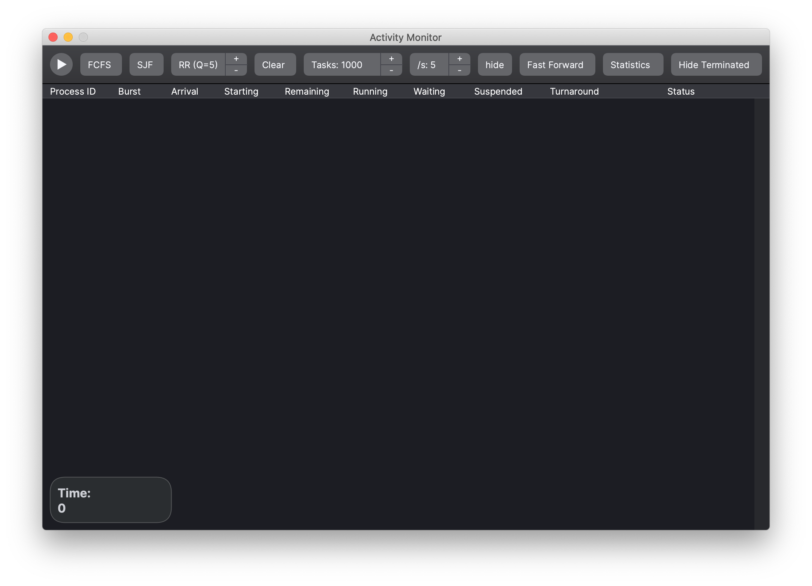
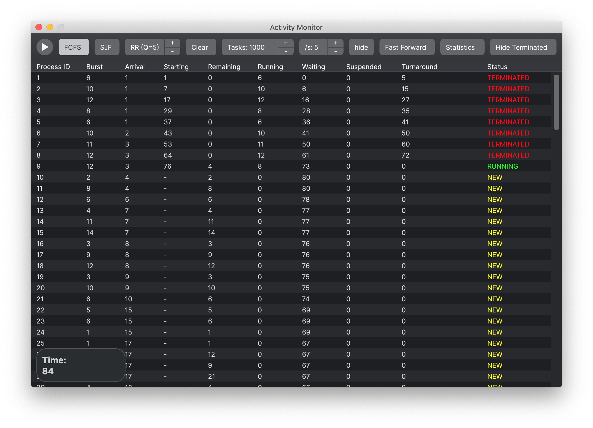
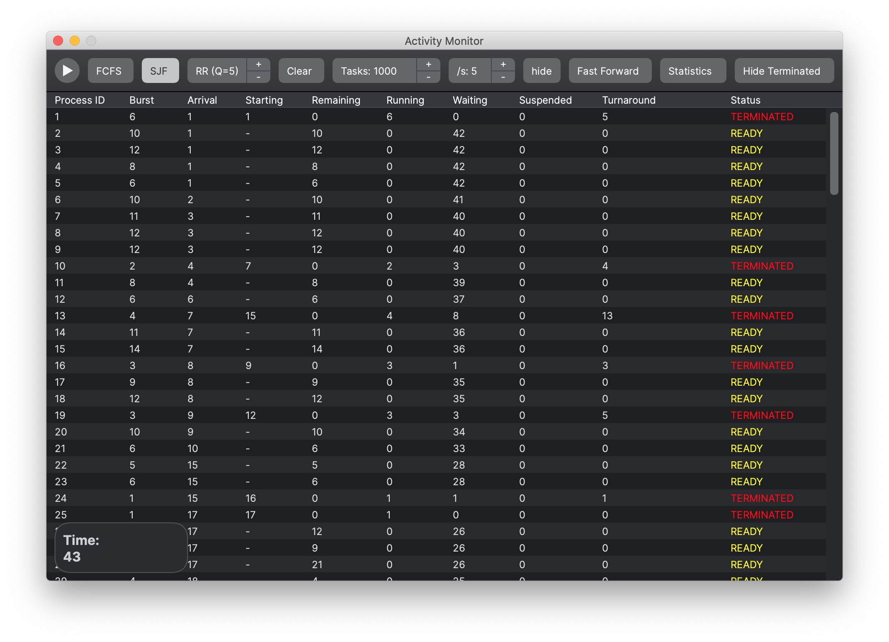
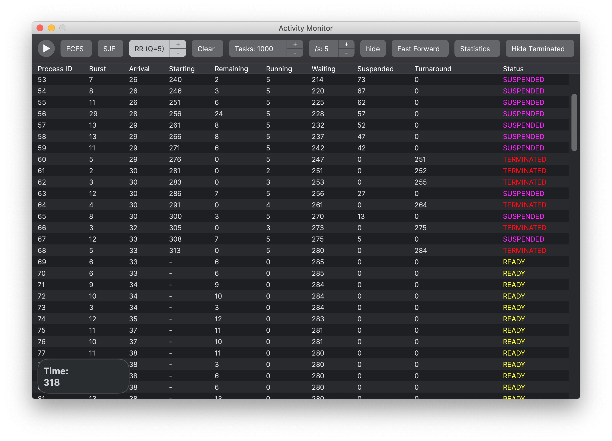
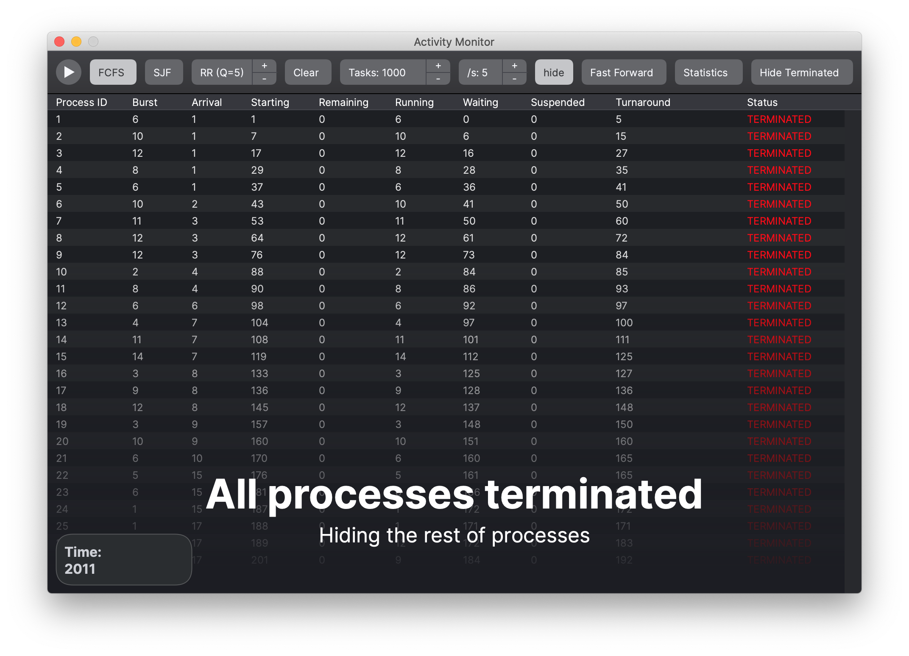
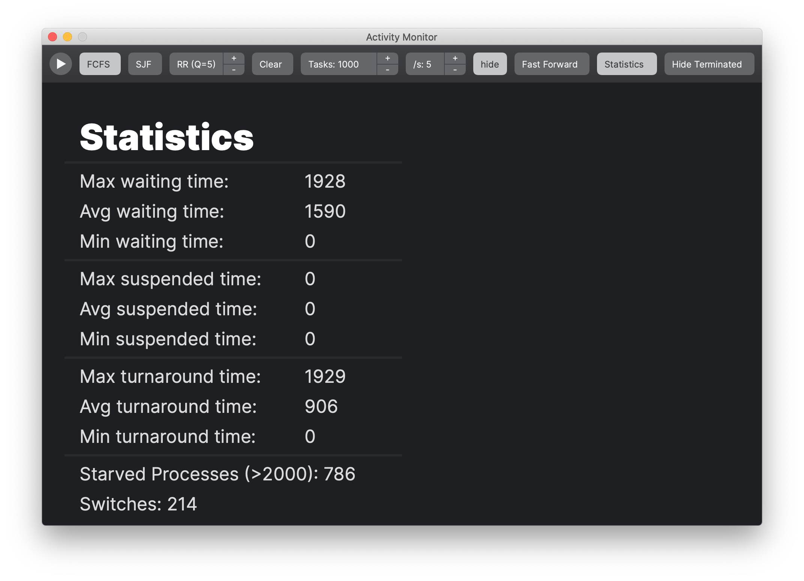
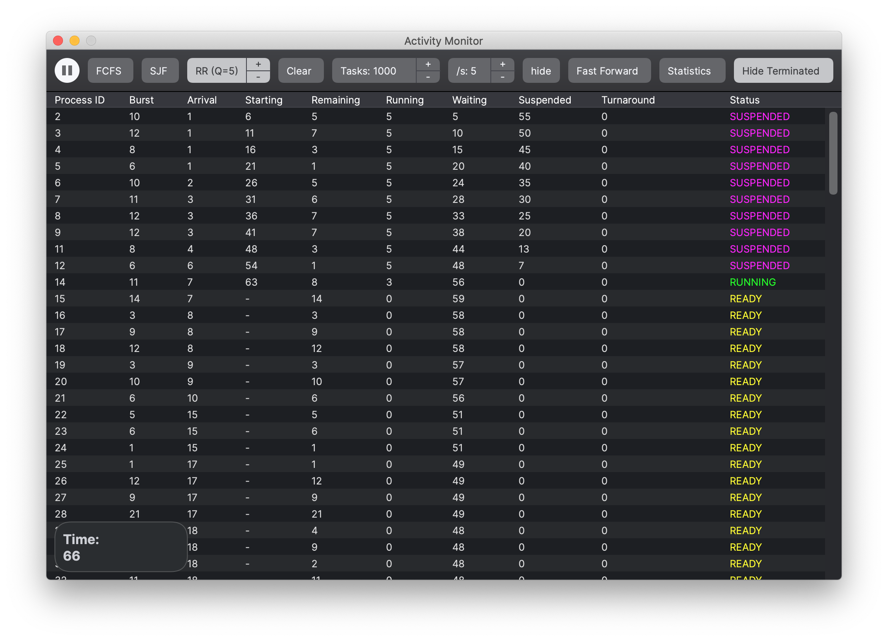

# scheduling-algorithms
 Excerice for my operating systems class – processor access scheduling algorithms 

## Main Screen

## First Come First Served

## Shortest Job First

## Round Robin

## Terminated Screen

## Statistics

## Terminated Hidden

